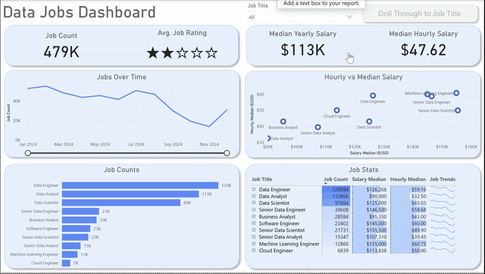
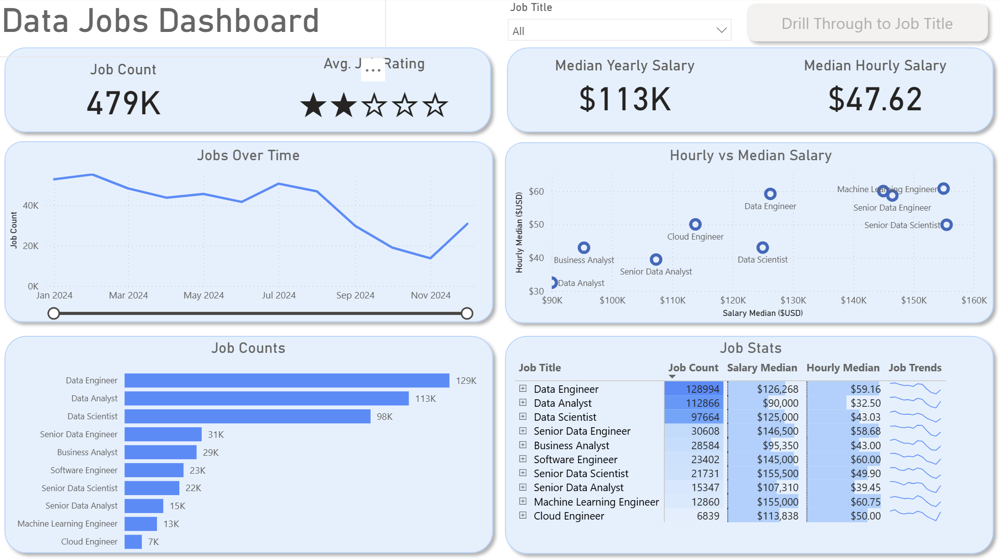
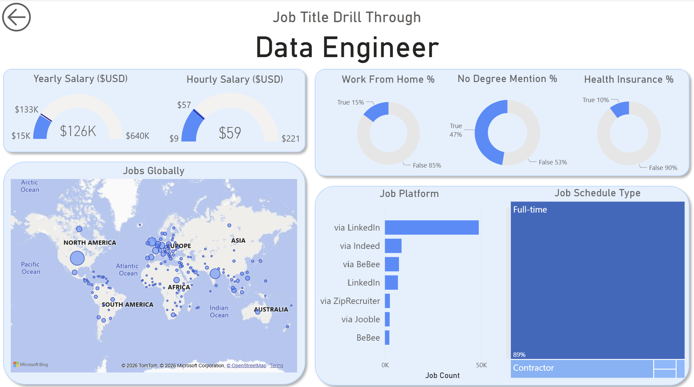

# 💼 Data Jobs Market Dashboard — Power BI

> **Power BI · Power Query · DAX · Star Schema · Geospatial Analysis · 2024 Job Postings**

---

## 🎬 Dashboard Demo



> *Job Title slicer filters all KPIs, charts, and salary data in real time.*

---

## 📸 Dashboard Preview

### Page 1 — Market Overview


### Page 2 — Job Title Drill-Through


---

## 🔍 Project Overview

This Power BI dashboard transforms a real-world dataset of **478,895 data science job postings from 2024** into an interactive career intelligence tool. Built for job seekers navigating a crowded and complex market, it surfaces compensation benchmarks, in-demand skills, geographic hotspots, and hiring platform trends — all filterable by job title through a dynamic slicer.

The dashboard spans two pages: a high-level market overview for quick pattern recognition, and a detailed drill-through view for deep-diving into specific roles — a structure directly mirroring how operational reporting dashboards are built in healthcare and supply chain environments.

---

## 🎯 Business Problem

The data job market generates enormous volumes of posting data that is difficult to navigate without structured analysis. This dashboard answers:

- What are the median salaries for each data role in 2024?
- Which skills are most frequently required across job postings?
- How does remote work availability vary by job title?
- Where are the highest concentrations of job postings globally?
- Which platforms post the most jobs for each role?
- How do job counts shift month-by-month across the year?

---

## 📁 Repository Structure

```
📦 data-jobs-market-dashboard/
│
├── 📊 Data_Jobs_Dashboard.pbix
├── 📄 README.md
├── 📄 DATA_DICTIONARY.md
│
├── 📁 data/
│   ├── job_postings_fact.csv      ← 478,895 job posting records
│   ├── company_dim.csv            ← 98,372 company records
│   ├── skills_dim.csv             ← 254 unique skills
│   └── skills_job_dim.csv         ← 2,274,756 skill-job relationships
│
└── 📁 assets/
    ├── dashboard_page1.png
    └── dashboard_page2.png
```

---

## 📐 Dataset at a Glance

| Attribute | Details |
|---|---|
| **Source** | Real-world 2024 Data Science Job Postings |
| **Total Job Records** | 478,895 postings |
| **Date Range** | January 1, 2024 – December 31, 2024 |
| **Companies** | 98,372 unique employers |
| **Skills Tracked** | 254 unique skills across 8 categories |
| **Skill-Job Links** | 2,274,756 relationships |
| **Countries Covered** | Global (US leads at 140,365 postings) |
| **Remote Work %** | 13.2% of all postings |
| **Median Yearly Salary** | $113,250 |

---

## 📊 Dashboard Pages

### Page 1 — High-Level Market Overview

Your mission control for the 2024 data job market. KPI cards display:
- **Total Job Count** across all titles and filters
- **Median Yearly Salary** and **Median Hourly Salary**
- **Skills Per Job** — average skill requirements per posting

Charts include monthly job volume trends, skill popularity rankings (by job count and % of postings), and salary comparisons across job titles — all dynamically filtered by the Job Title slicer.

### Page 2 — Job Title Drill-Through

Activated by right-clicking any job title on Page 1. Provides role-specific deep dives:
- Salary range distribution for the selected title
- Work-from-home availability percentage
- Top hiring platforms for that specific role
- Global map of job posting locations
- Top companies hiring for the role

---

## 🛠️ Power BI Skills Demonstrated

| Feature | Application |
|---|---|
| **Power Query (ETL)** | Data cleaning, type conversion, blank handling, column creation |
| **Data Modeling** | Star schema — fact table linked to 3 dimension tables |
| **DAX Measures** | `Median Yearly Salary`, `Job Count`, `Skills Per Job`, `WFH %` |
| **Slicers** | Job title filtering connected across both pages |
| **Drill-Through** | Right-click navigation from overview to role detail page |
| **Buttons & Bookmarks** | Navigation controls and saved report views |
| **Map Chart** | Global geospatial job distribution |
| **Column / Bar Charts** | Salary comparison, skill frequency ranking |
| **Line / Area Charts** | Monthly job volume trends |
| **KPI Cards** | Key metric highlighting |
| **Tables** | Sortable, granular data display |

---

## 📐 Data Model — Star Schema

```
                    ┌──────────────────┐
                    │  job_postings    │  ← FACT TABLE
                    │  (478,895 rows)  │
                    └──────┬───────────┘
                           │
          ┌────────────────┼────────────────┐
          ▼                ▼                ▼
  ┌──────────────┐  ┌──────────────┐  ┌──────────────┐
  │ company_dim  │  │ skills_job   │  │  skills_dim  │
  │ (98,372 cos) │  │ (2.27M rows) │  │ (254 skills) │
  └──────────────┘  └──────────────┘  └──────────────┘
```

---

## 📌 Key Findings

| Finding | Data |
|---|---|
| **Top in-demand skill** | Python (244,416 job mentions) followed by SQL (240,179) |
| **Highest paying role** | Senior Data Scientist — $155,500 median salary |
| **Most posted role** | Data Engineer — 128,994 postings (27% of all jobs) |
| **Top hiring platform** | LinkedIn — 149,955 postings (31% of all jobs) |
| **Remote availability** | Only 13.2% of all postings offer work-from-home |
| **Data Analyst median salary** | ~$90,000 — accessible entry point into the field |

---

## 🏥 Relevance to Target Roles

### Clinical Data Analyst / Healthcare Operations Analyst

| Dashboard Element | Healthcare Equivalent |
|---|---|
| Job count KPI cards | Patient census / encounter volume tracking |
| Monthly trend analysis | Seasonal admission or staffing demand forecasting |
| Salary benchmarking by title | Compensation equity analysis across care roles |
| Skills frequency ranking | Required clinical competency mapping |
| Star schema data model | EHR database architecture (fact + dimension tables) |
| Drill-through by job title | Department-level or provider-level operational drill-down |

### Supply Chain & Logistics Analyst

| Dashboard Element | Supply Chain Equivalent |
|---|---|
| Global map of job locations | Supplier / distribution center geographic mapping |
| Platform analysis (where jobs are posted) | Vendor or carrier channel performance tracking |
| Skill demand ranking | Core competency gap analysis across logistics functions |
| Monthly volume trends | Shipment demand forecasting and seasonal planning |
| DAX measures for KPIs | KPI calculation for OTD, fill rate, cost per unit |

---

## 🚀 How to Open This Dashboard

1. Download `Data_Jobs_Dashboard.pbix` from this repository
2. Open in **Power BI Desktop** (free — download at powerbi.microsoft.com)
3. All data is embedded in the `.pbix` file — no external connections needed
4. Use the **Job Title slicer** on Page 1 to filter the entire dashboard
5. Right-click any job title → **Drill Through** to navigate to Page 2

---

## 📬 Connect

**Loknadh Venkata Krishna Sai Kona**
MS Data Science · University of Memphis (GPA: 3.81, Dec 2025)
🔗 [LinkedIn](https://linkedin.com/in/lvkrishna3/) · 🐙 [GitHub](https://github.com/KrishnaSai315)
